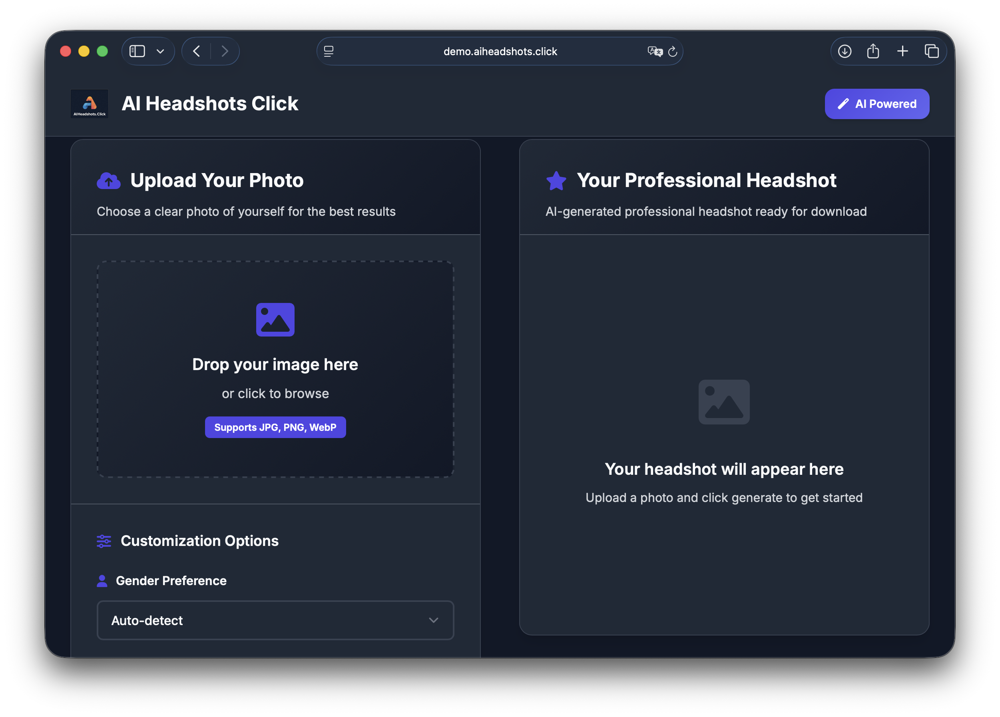
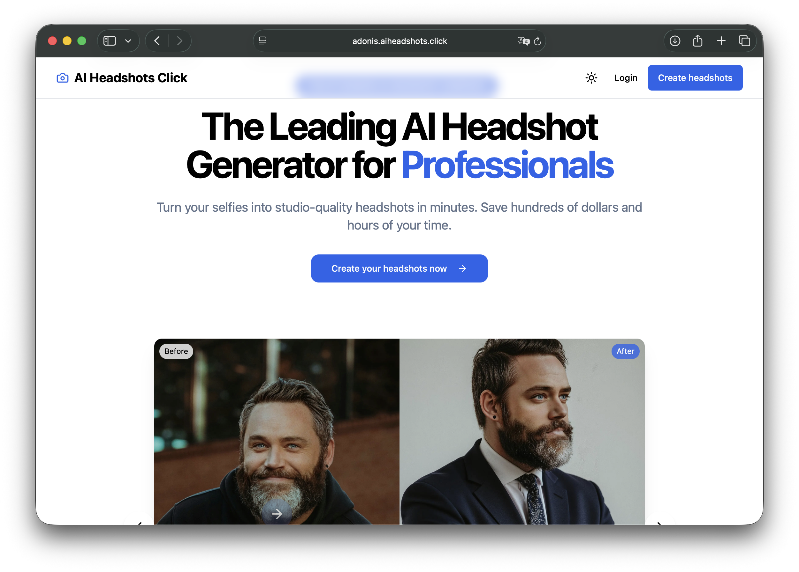
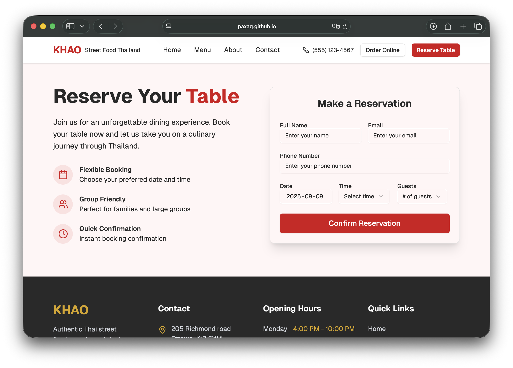
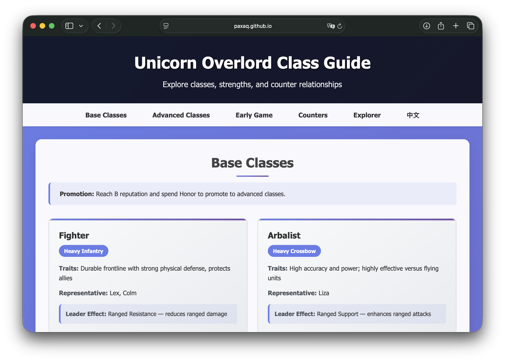

  

  

  <section class="hero">
    

      
    

    

      
Full-Stack Builder &amp; Problem Solver

      <h1>Jason</h1>
      
<a href="mailto:pan00074@algonquinlive.com">pan00074@algonquinlive.com</a> · <a href="https://www.linkedin.com/in/paxaq/" target="_blank" rel="noopener noreferrer">LinkedIn</a> · <a href="https://github.com/paxaq" target="_blank" rel="noopener noreferrer">GitHub</a>

      

        <a class="button primary" href="resume.txt" target="_blank" rel="noopener noreferrer">Download Résumé</a>
        <a class="button ghost" href="#projects">View Projects</a>
      

    

  </section>

  <section class="content-grid">
    <article class="section-card accent">
      <h2>About Me</h2>
      
A dedicated WDIA student at Algonquin College, with a strong background in the IT industry and a passion for web development and software solutions. Academic projects and internship experiences equipped with skills in designing and maintaining web applications, collaborating in remote team settings, and adapting to new technologies.

      <ul class="highlight-list">
        <li>Over a decade of experience leading cross-functional teams.</li>
        <li>Focused on crafting reliable, human-centered digital products.</li>
        <li>Constantly exploring AI-assisted workflows to accelerate delivery.</li>
      </ul>
    </article>

    <article class="section-card">
      <h2>Core Toolbox</h2>
      

        CC++C#PythonJavaScriptHTMLCSSPHPSQL
        .NETDockerGitLinuxNetwork ArchitectureProject Leadership
      

      <table class="skills-table">
        <tr>
          <th>Category</th>
          <th>Skills</th>
        </tr>
        <tr>
          <td>Programming &amp; Development</td>
          <td>C, C++, C#, JavaScript, HTML, CSS, Python, PHP, SQL</td>
        </tr>
        <tr>
          <td>Operating Systems</td>
          <td>Linux (Red Hat, Debian, Ubuntu), Server Administration</td>
        </tr>
        <tr>
          <td>Networking</td>
          <td>Network Architecture, TCP/IP, DNS, DHCP, VPNs, Firewall Configuration, Security Protocols</td>
        </tr>
        <tr>
          <td>Frameworks &amp; Platforms</td>
          <td>.NET, Git, Docker</td>
        </tr>
        <tr>
          <td>Concepts</td>
          <td>Web Design, Prototyping</td>
        </tr>
        <tr>
          <td>Leadership &amp; Management</td>
          <td>Project Management &amp; Delivery, Team Leadership &amp; Mentoring, IT Strategy &amp; Operations, Budgeting &amp; Financial Oversight, Vendor &amp; Stakeholder Management, Process Improvement</td>
        </tr>
      </table>
    </article>

    <article class="section-card" id="projects">
      <h2>Signature Projects</h2>
      <ul class="project-list">
        <li class="project-card">
          

            <h3>pyheadshotsclick</h3>
            
A Python-driven AI photo service delivering high-quality, ready-to-use headshots with automated workflows.

            
<a href="https://github.com/paxaq/pyheadshotsclick.git" target="_blank" rel="noopener noreferrer">GitHub</a> · <a href="https://demo.aiheadshots.click" target="_blank" rel="noopener noreferrer">Live Demo</a>

          

          

            
          

        </li>
        <li class="project-card">
          

            <h3>pp-headshots-starter1</h3>
            
A production-ready headshot generation platform, featuring onboarding flows, payment integrations, and user management.

            
<a href="https://github.com/PixelPeers/pp-headshots-starter1.git" target="_blank" rel="noopener noreferrer">GitHub</a> · <a href="https://adonis.aiheadshots.click" target="_blank" rel="noopener noreferrer">Live Demo</a>

          

          

            
          

        </li>
        <li class="project-card">
          

            <h3>khaostreetfood-website</h3>
            
An immersive restaurant experience site with bold visuals, online ordering, and responsive layouts tailored for food lovers.

            
<a href="https://github.com/paxaq/khaostreetfood-website.git" target="_blank" rel="noopener noreferrer">GitHub</a> · <a href="https://paxaq.github.io/khaostreetfood-website" target="_blank" rel="noopener noreferrer">Live Demo</a>

          

          

            
          

        </li>
        <li class="project-card">
          

            <h3>UOgameinfos</h3>
            
A comprehensive Ultima Online guide consolidating gameplay systems, build paths, and community strategies.

            
<a href="https://github.com/paxaq/UOgameinfos.git" target="_blank" rel="noopener noreferrer">GitHub</a> · <a href="https://paxaq.github.io/UOgameinfos/" target="_blank" rel="noopener noreferrer">Live Demo</a>

          

          

            
          

        </li>
      </ul>
    </article>

    <article class="section-card accent">
      <h2>Education Journey</h2>
      

        

          
2025 – Present

          

            <h3>Algonquin College · Web Development &amp; Internet Applications</h3>
            
Relevant Coursework: C# Programming, Web Development, Software Engineering, Database Management

            
GPA: 3.96 / 4.00

          

        

        

          
2004 – 2006

          

            <h3>Fudan University · Master of Software Engineering</h3>
            
Relevant Coursework: E-Commerce, Project Management, Advanced Computer Networks, Software Process Management, Operations Management

          

        

      

    </article>
  </section>

